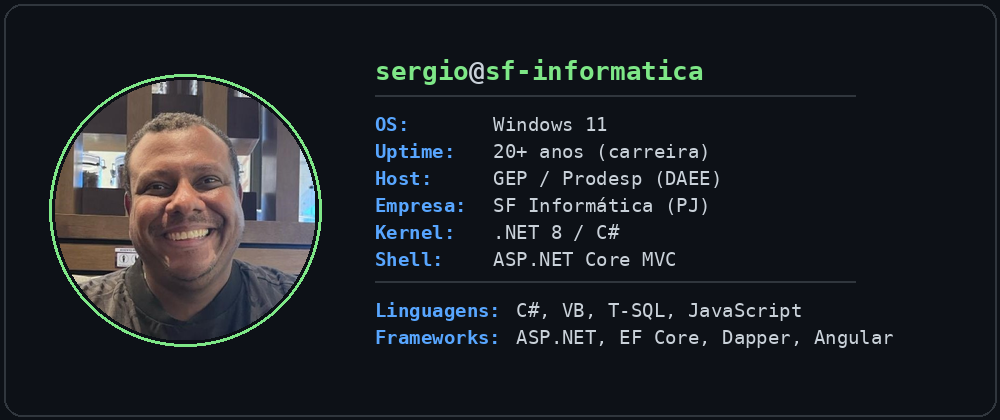

### Sergio Farias
**Desenvolvedor .NET | C# • VB • SQL • Angular • Sistemas Legados • Sustentação**

- 💼 PJ pela **SF Informática**, atendendo clientes corporativos
- 🏛️ Atuação concomitante via CLT na **GEP/Prodesp**, no projeto **DAEE**
- 🎓 MBA
- 📍 Rio de Janeiro (Jacarepaguá), RJ
- 🛠️ Stack: ASP.NET Core MVC · EF Core · Dapper · SQL Server/T-SQL · Sybase ASE · Razor · Tailwind CSS · Angular · DDD
- 🏦 Background sólido em sistemas bancários e governamentais, incluindo migração e sustentação de sistemas legados VB6 → .NET
- 🔗 [LinkedIn](https://www.linkedin.com/in/sergio-farias/) · [GitHub](https://github.com/sergfarias)

<!--
Preencha se quiser adicionar:
- E-mail: [seu e-mail]
-->
